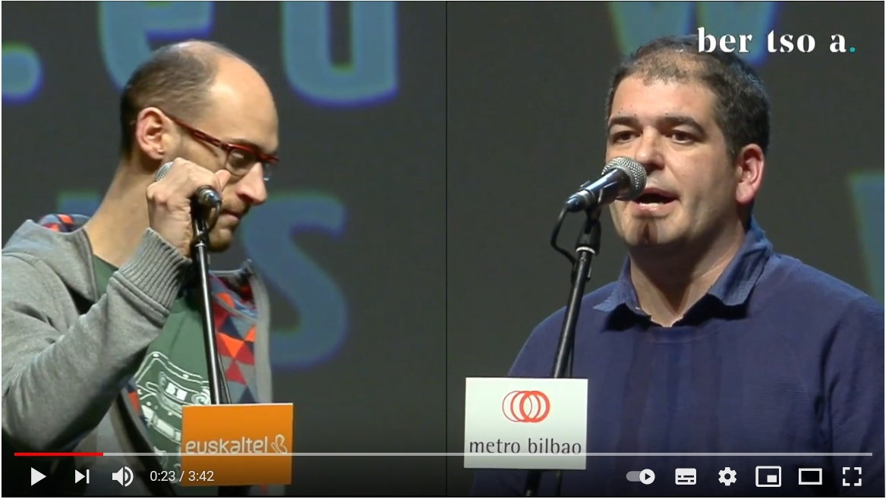

# Can AI boost tradition?

Tradition, from latin tradere, to transmit, is the act of sharing a behavior or belief from generation to generation. And as such, this heritage becomes part of our ourselves, our identity.

Innovation, in contrast, is the introduction of new ideas, of new ways or approaches that change how things were done before. This new approaches are often seen as a threat to tradition, as the adoption of new methods or behaviors tends to change the way that things were done, the tradition.

However, do things always need to be this way? Can innovation be used to leverage and spread tradition among society?

### Bertso, doinu and neurri a glimpse of the basque tradition

Among the various treasures basque culture has manged to keep alive are **bertsoak**, improvised verses with **rhyme** that are sung following a **doinu**, a melody, that has to match with certain **neurri**, or verse length.

This bertsos are typically sung in front of an audience, and, the **bertsolaris**, the basque rhyme singers, sing about different topics which are provided by the moderator, **gaijartzaile**, while they interact with the rest of bertsolaris (in a rather acid way) in pursue of the public's applause.

How does this look like? Well lets take a look of how a modern bertso saio looks like lets take a look to the following video.

Did you notice that the base used by both of the bertsolari is the same? This base is called doinu(a). Doinus are transmitted from generation to generation, and it is very important for bertsolaris to know them well, because they need to use the doinu suggested by the **gaijartzaile** (moderator) or the other bertsolaris to sing their bertsoz. 

### Can we improvise over the improvisation?

Bertsoz are like rap, and rap battles happen on the fly, there is no script to follow. This means the abbility of the bertsolari to improvise becomes the cornerstone of the bertso. However, the base, the doinu, is already known by everyone, it is something fixed, rigid.

Which is a pity, isn't it? If improvisation is part of the great art of the bertsolari... Why not provide an improvised doinu so that the bertso experience becomes even more challenging and unique?

With these thoughts in mind, and with the newly adquiered Deep Learning skillset, @jperezvisaires and @klopetx had an instant match in our mind. If there was anything that could create doinus by itself... that would be a Generative Adversarial Network.

Could bertsolarisim be revolutionized with the use of AI? 

Well... maybe not that much, but it was worth a try.

## GANS where technology and tradition (could) meet

With the insightful courses we had during our SaturdayAI lessons, we learned about the latest innovations on the field of Deep Learning, such as the different architectures, (convolutional, recurrent, autoencoder...) as well as the different uses such as reinforcement learning and generative adversarial networks. The question at this point was, could the magic of generative adversarial networks be used to create new doinus? If so, what did we need for that purpose?

Data! Of course.

## Gathering the data

Fortunately for us (and for the basque culture) there exists an entity, Bertsozale Elkartea, who has a webpage that includes all the known doinus, around 3000, with their meta-data included. It is in basque, but just in case you wanted [to give it a look.](https://bdb.bertsozale.eus/web/doinutegia/emaitzak?bilatu=&izena=&hidden_izena=&mota=0&sortzailea=&hidden_sortzailea=&bertsolaria=&hidden_bertsolaria=&jasotzailea=&hidden_jasotzailea=&jasoa=&hidden_jasoa=&urtea=&kriterioak_gorde=1) 

And well... you know what they say right? 
It's easier to ask for forgiveness than to get permission... 
So... We scrapped the web (thank you bertsozale for your work, and sorry for overloading your servers and getting your data wihout formally asking permission).

First we downloaded the metadata of the doinus. We made a selection of the most used ones considering the number of syllables and type, and we donwloaded the 'Zortziko/Txiki' ones that had 7 syllables in the first berse followed by 6 in the second which decreased the list of doinus to around 200.

### Midi format

"But wait a minute, donwload what exactly?"

Fortunately for us, we had the chance to download the doinus in either mp3 or midi formats.

"Midi? What's that? I know about mp3 but midi reminds me of how french people names the mid day..."

MIDI (Musical Instrument Digital Interface) is a technological standard used to transfer up to 16 information channels. It transfers messages of events that include musical notation, tone and speed among other things. Basically, this files explain what notes are played, when, for how long and how loud. 

### Feeding our little generative monster

Once the ~~lunch~~ data was ready, we just needed to feed the ~~troll~~ GAN.

And our experience of using midi directly for the GAN is perfectly summarized by the following poem:

We used the midi as input
Well, at least we tried
we faced some problems
and hence, gave up.

You know, everyone uses Deep Learning with images, why should we do otherwise?

So, instead of using midis directly, we created images with them, cause, due to the nature of the midi files, it is quite simple to visualize/represent them as images.

Once at the more comfortable image domain it was easier to work with the problem, as there is much more content dealing with images and convolutional neural networks.

## GAN structure

Let's take a breath for a second. We started talking about how well GANs are supposed to work in the creation of new unheared soinus, but what are GANs exactly?

GANs were introduced [by Goodfellow et. al.](https://papers.nips.cc/paper/2014/file/5ca3e9b122f61f8f06494c97b1afccf3-Paper.pdf) and are essentially two separate models that are trained together with an opposed purpose. One of the models, the generator, generates new data samples from a random seed; the second model, the discriminator, tries to tell whether the data is original (real) or if it was created by the generative model (fake). Due to their behavior, they are typicall compared to a counterfeiter and a cop. The counterfeiter keeps improving the quality of the works while the cop gets better at detecting which ones are real or faked.

Basically, during the training process, the counterfeiter should get much better at creating new data (in this case images of new possible doinus) while the cop should improve at the detection of fake doinus, forcing the improvement of the counterfeiter. At some point, the generative model should be good enough at creating doinus that it would become absolutely impossible for the discriminative model to discern among real or fake doinus, meaning we have a model capable of creating good enough doinus.

Easy peasy lemon squeezy isn't it?

SPOILER: Nothing went as expected.

### Round 1: If what one has to say is not better than silence...

We started to feed our monster (well, monsters actually).
We waited until the training converged.
And we freaked out with the resulting doinus.

Yes, an empty midi. Apparently our GAN was so smart that it preferred to remain silent instead of saying something worse than silence... It went full Simon & Garfunkel and published its own version of the Sound of Silence.

Why?

The images we were trying to create were really sparse, with lots of zeroes and only some ones on the notes being played. The generator initially learnt that by switching all the pixels off, it could trick the dumb discriminator at the beginning. However, during training, at some point, even the dumbest of discriminators was able to detect that a blank image was not a real doinu, which meant that all the efforts made by the generator to produce blank images from noise were now worthless. The generator was not able to adapt fast enough to trick the new discriminator and the training diverged.

To solve the problem of sparse images, we took the argmax of all the columns, esentially turning a 128x1024 image into a a 1x1024 vector. This was possible because the doinus only play one note at a time.

Lesson: Ensure you synthesize your data as much as possible, make life easy for your neural networks.

### Round 2: Damn it! How cares about mixing different doinus? 

Initially, we wanted the generator to focus on creating one type of doinu only; the most popular doinu: zortziko txikia. We only had about 180 usable samples of this kind of doinu, and it soon became apparent that training GANs requires a substantial amount of data just to get barely passable results. So instead of focusing on a small fraction of the doinus, we decided to take all the database in the end. This meant jumbling all kind of different doinus together, but got us a dataset of around 2700 samples; still really small for GAN training, but worth a shot.  

Yeap, the whole database with the different neurris, rhymes etc. 
Everything.
Goes.
In.

In addition, we reduced the resolution of the images so that they were less sparse, in order to avoid the problem of the shy gan.
And we reduced the midi resolution even more. We needed to simplify if we wanted to make some kind of progress.

And, surprisingly, the magic happened.

[Include link to midi]

## Lessons learned

The amount of data needed to properly train a GAN is a lot more than we had available, bigger datasets give better results in this kind of networks. Few-shot learning in GANs is a key point being worked on in the academic community right now.

Time is key in training GANs, if the training is stable and there aren't any divergences, the results keep improving with training time, sometimes getting pretty good results as the training goes on.

Simplify the data to be generated and fed to the neural networks as much as possible. Make life easier for your neural networks. Sparse matrices are the devil and should be condensed into a vector if possible, as neural networks love give outputs full of zeroes if available to them.

